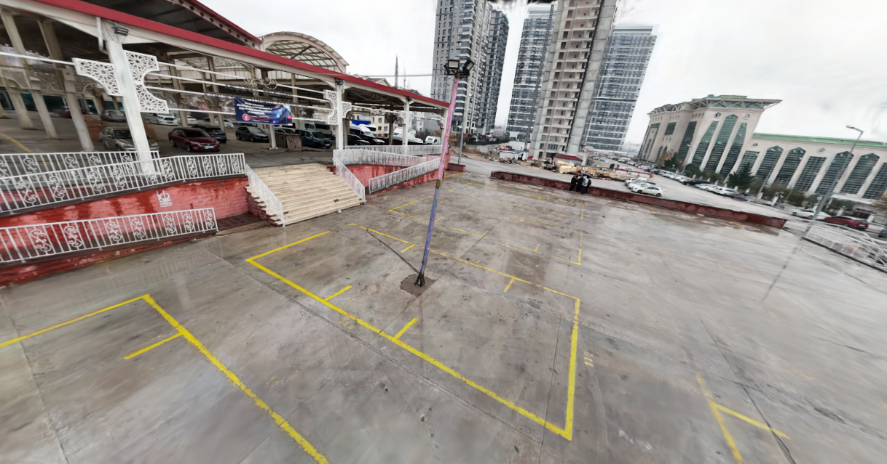
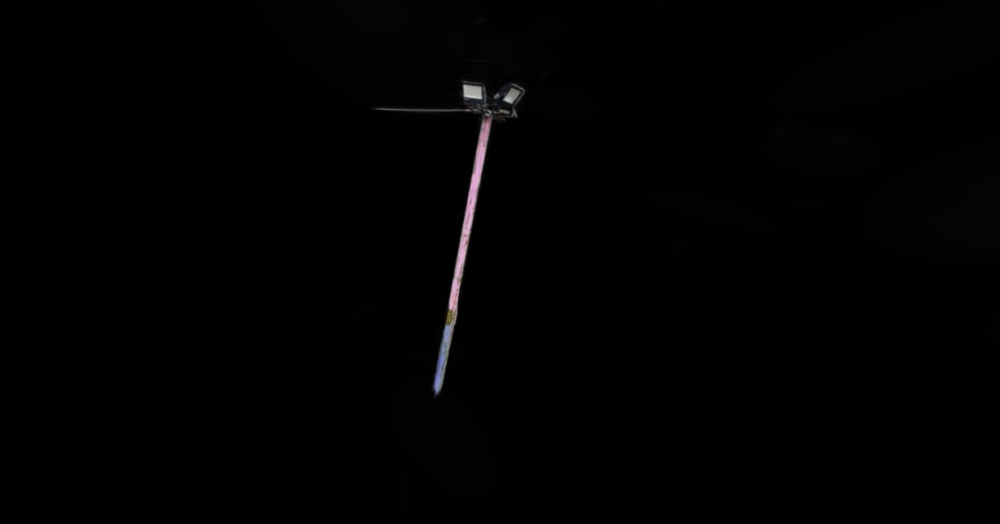
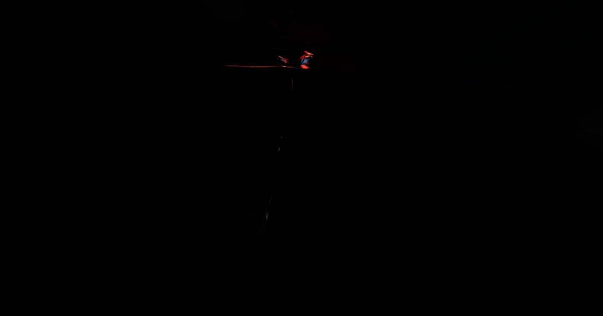
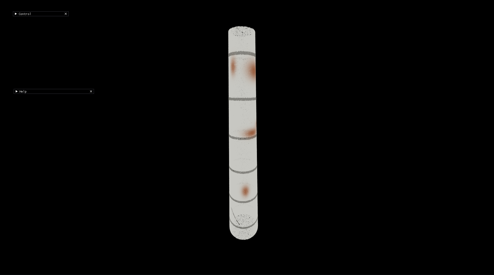
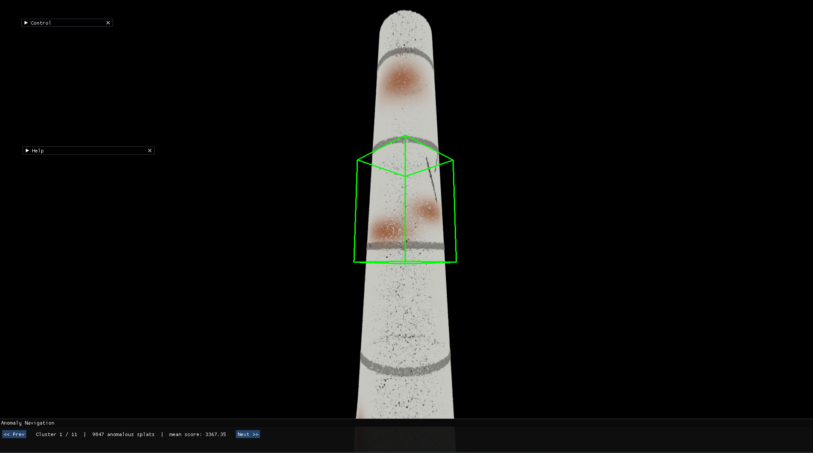
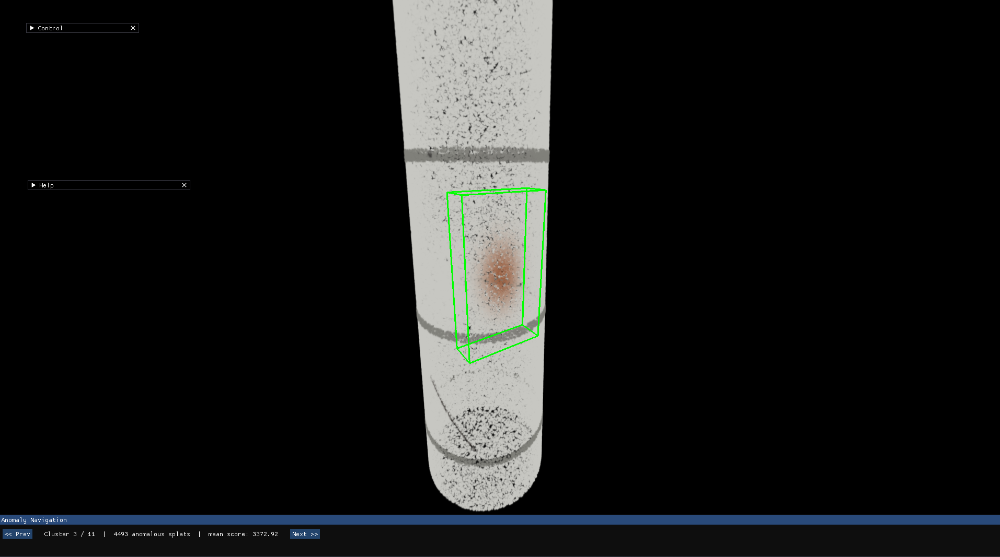
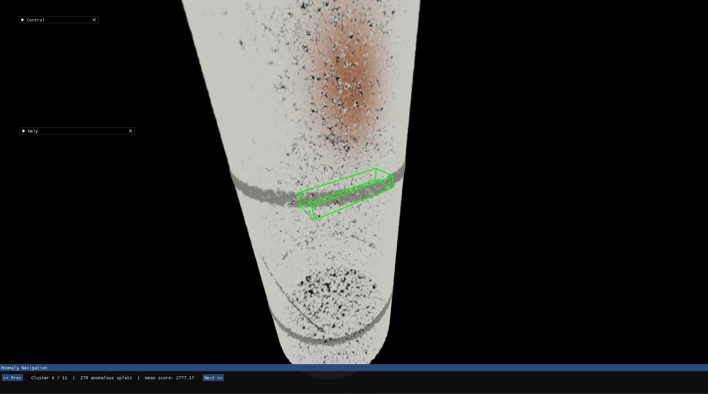

# Gaussian Splat Based Anomaly Detection

**Automated Defect Detection of Tall Structures**

> Ömer Faruk Özyağlı · Emre Demirbaş
> Supervisor: Assoc. Prof. Fatih Nar
> Department of Computer Engineering, Ankara Yıldırım Beyazıt University
> IEEE ICARA 2026 — DOI: [10.1109/ICARA69401.2026.11480350](https://doi.org/10.1109/ICARA69401.2026.11480350)

📄 **[Poster (PDF)](docs/poster.pdf)**

---

## Overview

Inspecting tall structures (cell towers, wind turbines, light poles) traditionally requires rope access or scaffolding — dangerous, costly, and slow. This project automates the process end-to-end:

1. A UAV captures imagery around the structure.
2. **3D Gaussian Splatting (3DGS)** reconstructs a photorealistic digital twin.
3. Our pipeline **isolates the target structure** from background clutter, **detects anomalies** (corrosion, cracks, missing bolts, deformed panels) without any labelled training data, and presents flagged regions in an **interactive 3D viewer** for inspector review.

The system is fully automated, requires no manual annotation, and works on any structure type.

---

## Results

Real-world evaluation on a light-pole inspection scene:

| (a) Raw drone capture | (b) Isolated reconstruction | (c) Anomaly overlay |
|:---:|:---:|:---:|
|  |  |  |
| Background clutter (ground markings, buildings) dominates the raw 3DGS volume. | Lamp pole and fixtures cleanly separated after Stages 1–2, **without semantic supervision**. | RRX + CFAR ($P_\text{fa}=0.01$) flags the defect cluster; DBSCAN groups anomalous Gaussians into spatially coherent regions. |

### Synthetic Defect Clustering

To rigorously evaluate the CFAR thresholding and spatial clustering without the interference of background geometry, we test the anomaly detector on isolated synthetic structures:

| Original Synthetic Chimney | Defect Cluster 1 | Defect Cluster 3 | Defect Cluster 6 |
|:---:|:---:|:---:|:---:|
|  |  |  |  |
| Pristine synthetic chimney with embedded structural defects. | The pipeline accurately identifies and bounds corrosion patches. | Deformed panels successfully isolated. | Minor cracks detected via RRX feature deviation. |

---

## System Architecture

The pipeline runs in three stages.

```
INPUT                  STAGE 1 — Object Isolation
─────────────────────  ──────────────────────────────────────────────────────
Camera Trajectory  ──► Trajectory Smoothing → PCA Alignment → Ellipsoid Filter
Gaussian Splat Scene    → Ground Removal (RANSAC) → SDF Fine Filter → SOR
Sparse Reconstruction
                       STAGE 2 — GSplat Extraction
                       ──────────────────────────────────────────────────────
                       Sphere Filter → Scale Filter

                       STAGE 3 — Anomaly Detection
                       ──────────────────────────────────────────────────────
                       Feature Extraction → Feature Normalisation
                       → Randomised RX Detector → CFAR Thresholding
                       → DBSCAN Clustering

OUTPUT
──────────────────────────────────────────────────────────────────────────────
Filtered Point Cloud + Anomaly Point Cloud → Decision-Support Viewer
```

---

## Methodology

### Stage 1 — Structure Isolation

#### 1.1 Trajectory Smoothing

Raw COLMAP camera centres are smoothed by minimising a curvature-penalised least-squares energy. Let $P \in \mathbb{R}^{N\times 3}$ be the raw centres and $D$ the second-difference operator:

$$
\hat{p} = \arg\min_{X}\; \lVert X - P \rVert^{2} \;+\; \lambda\,\lVert D X \rVert^{2}
\quad\Longrightarrow\quad
(I + \lambda\,D^{\!\top}\!D)\,\hat{p} = P,\;\;\lambda = 10^{7}
$$

Solved independently per axis. The smoothed centres form the **anchor set**.

#### 1.2 PCA Alignment & Ellipsoid Filter

Scene points are rotated into the trajectory's principal frame. An inflated ellipsoid (×1.5 radii, 95th-percentile extent) coarsely gates background:

$$
C = \tfrac{1}{N}(X-\mu)^{\!\top}(X-\mu) = V\,\Lambda\,V^{\!\top}
$$

$$
\text{keep } \tilde{p}\;\iff\; \frac{\tilde{p}_x^{2}}{a^{2}} + \frac{\tilde{p}_y^{2}}{b^{2}} + \frac{\tilde{p}_z^{2}}{c^{2}} \le 1
$$

#### 1.3 RBF Signed-Distance Field

RANSAC removes the ground plane (1 000 iterations, inlier distance 0.1 m). A radial-basis SDF envelopes the structure; each anchor contributes three labelled samples ($-1$ inside, $0$ on surface, $+1$ outside):

$$
K_{ij} = \exp\!\left(-\frac{\lVert \tilde{x}_i - \tilde{x}_j\rVert^{2}}{2\sigma^{2}}\right),\quad \sigma = 20
$$

$$
(K + \varepsilon I)\,w = s
\quad\Longrightarrow\quad
\text{keep splat } q \iff d(q) < 0
$$

Statistical Outlier Removal (k = 50, ratio ≤ 1.5) cleans residual noise.

### Stage 2 — GSplat Extraction

The sparse mask is transferred to the dense Gaussian model via two filters:

$$
\text{Sphere:}\quad \text{keep } q_j \iff \exists\,c \in \mathcal{C} : \lVert q_j - c \rVert \le 0.5\,\text{m}
$$

$$
\text{Scale:}\quad \text{keep } q_j \iff \max\!\big(\exp(\mathrm{scale}_k)\big) < 0.5
$$

### Stage 3 — Automated Anomaly Detection

#### 3.1 10-D Feature Representation

Each retained splat is encoded as a 10-dimensional vector and normalised with a robust scaler (median / IQR):

$$
f = [\,x,\,y,\,z,\,f_{\text{dc},0..2},\,\text{opacity},\,s_{0..2}\,] \in \mathbb{R}^{10}
$$

#### 3.2 Random Fourier Feature (RFF) Mapping

$D = 300$ random frequencies approximate the RBF kernel ($\sigma$ estimated via median pairwise distances), lifting features into a 600-D space:

$$
\omega_i \sim \mathcal{N}(0,\,\gamma^{2} I_d),\quad \gamma = 1/\sigma
$$

$$
z(x) = \frac{1}{\sqrt{D}}\,\big[\cos(\Omega x),\,\sin(\Omega x)\big] \in \mathbb{R}^{600}
$$

This approximates $K(x,y) = \exp\!\big(-\lVert x-y\rVert^{2}/2\sigma^{2}\big)$ with $\mathcal{O}(nD)$ complexity.

#### 3.3 Randomised RX Anomaly Score

The Mahalanobis distance in RFF space measures how far each splat deviates from the background covariance:

$$
G = \tfrac{1}{n}\,Z_{c}^{\!\top}Z_{c} + \varepsilon I,\quad \varepsilon = 10^{-6}
$$

$$
\delta(x^{\ast}) = z^{\ast\top}\,G^{-1}\,z^{\ast}
$$

#### 3.4 CFAR Threshold & DBSCAN Clustering

The best-fit distribution over $\{\Gamma,\;\log\!\mathcal{N},\;\chi^{2},\;\text{Weibull},\;\text{Nakagami},\,\ldots\}$ is selected by the Kolmogorov–Smirnov test. The CFAR threshold controls the false-alarm rate exactly:

$$
\tau = F^{-1}\!\big(1 - P_\text{fa}\big),\quad P_\text{fa} = 0.01
$$

$$
\text{anomaly} \iff \delta(x) > \tau
$$

DBSCAN ($\varepsilon = 0.5$, `min_samples` = 10) groups flagged splats into spatially coherent clusters.

---

## Installation

### Pipeline

```bash
pip install numpy scikit-learn scipy matplotlib
```

### 3DGS Viewer

```bash
pip install -r gsplat_viewer/requirements.txt
# Optional: PyTorch or CuPy for accelerated sorting
# Optional: diff-gaussian-rasterization + cuda-python for CUDA rendering
```

---

## Usage

### Full pipeline (isolation + anomaly detection + viewer)

```bash
python src/run_pipeline.py \
    --images_bin  src/data/real/lamb/input/images.bin \
    --sparse_ply  src/data/real/lamb/input/points3D.ply \
    --gsplat_ply  src/data/real/lamb/input/point_cloud.ply \
    --output_ply  src/data/real/lamb/output/output_ad.ply
```

Add `--no_viewer` to skip launching the interactive viewer.

### Anomaly detection only (skip structure isolation)

Use this when the GSplat has already been isolated, e.g. for clean synthetic scenes:

```bash
python src/run_ad_only.py \
    --gsplat_ply src/data/synthetic/synth_clean/gsplat.ply \
    --output_ply src/data/synthetic/synth_clean/output.ply \
    --pfa 0.1
```

### Generate synthetic data

```bash
cd src
# Generate a full scene with ground and clutter
python -m synthetic.generate --out-dir data/synthetic/my_scene --seed 42

# Generate a clean object-only scene (for direct AD testing)
python -m synthetic.generate --out-dir data/synthetic/synth_clean --no_background --seed 42
```

Outputs: `images.bin`, `sparse.ply`, `gsplat.ply`, `ground_truth_labels.npy`, `meta.json`. Four defect types are embedded: corrosion patches, cracks, missing bolts, deformed panels.

### Evaluate against ground truth

```bash
python src/evaluate.py \
    --gsplat_ply src/data/synthetic/synth_multi/gsplat.ply \
    --output_ply src/data/synthetic/synth_multi/output.ply \
    --gt_labels  src/data/synthetic/synth_multi/ground_truth_labels.npy \
    --meta       src/data/synthetic/synth_multi/meta.json
```

Reports per-defect-type precision, recall, and F1.

### Visualize results

```bash
python src/visualize_results.py \
    --gsplat_ply src/data/synthetic/synth_multi/gsplat.ply \
    --output_ply src/data/synthetic/synth_multi/output.ply \
    --gt_labels  src/data/synthetic/synth_multi/ground_truth_labels.npy \
    --meta       src/data/synthetic/synth_multi/meta.json \
    --save_dir   src/data/synthetic/synth_multi/figures
```

### Key pipeline arguments

| Argument | Default | Description |
|---|---|---|
| `--smooth` | `1e8` | Trajectory smoothing $\lambda$ (0 disables) |
| `--sigma` | `20.0` | RBF kernel bandwidth for SDF |
| `--inflate_factor` | `1.5` | Ellipsoid inflation multiplier |
| `--ellipsoid_percentile` | `95` | Percentile for ellipsoid radii |
| `--sphere_radius` | `0.5` | Sphere radius around sparse points (m) |
| `--scale_threshold` | `0.5` | Max Gaussian splat scale (after exp) |
| `--pfa` | `0.01` | CFAR probability of false alarm |
| `--cluster_eps` | `0.5` | DBSCAN $\varepsilon$ for anomaly clustering |
| `--viz` | off | Visualise 2D SDF contour |

---

## Repository Structure

```
.
├── README.md
├── docs/
│   ├── poster.pdf                # IEEE ICARA 2026 poster
│   ├── pipeline-render.html      # Interactive pipeline diagram
│   └── pipeline-diagram.jsx      # React component for the diagram
├── figures/                      # Result figures used in the README
│   ├── results_a.png
│   ├── results_b.png
│   └── results_c.png
│
├── src/
│   ├── main.py                   # Full pipeline entry point
│   ├── run_pipeline.py           # Pipeline + viewer launcher
│   ├── run_ad_only.py            # Anomaly detection only (no isolation)
│   ├── evaluate.py               # Evaluation against ground truth
│   ├── visualize_results.py      # Result visualisation
│   │
│   ├── io_utils.py               # COLMAP reader, PLY I/O
│   ├── math_utils.py             # PCA, trajectory smoothing
│   ├── ellipsoid_filter.py       # Stage 1 — coarse ellipsoid filter
│   ├── ground_filter.py          # Stage 1 — RANSAC ground removal
│   ├── sdf.py                    # Stage 1 — RBF signed-distance field
│   ├── outlier_filter.py         # Stage 1 — statistical outlier removal
│   ├── sphere_filter.py          # Stage 2 — sphere filter
│   ├── anomaly_detector.py       # Stage 3 — RRX + CFAR
│   ├── cluster_metadata.py       # Cluster bounding boxes & metadata
│   ├── cluster_io.py             # Cluster save/load
│   │
│   ├── synthetic/                # Synthetic scene generator
│   │   ├── generate.py           # CLI: generate chimney scenes
│   │   ├── geometry.py           # 3D primitives
│   │   ├── defects.py            # Defect injection (4 types)
│   │   ├── trajectory.py         # Orbital camera trajectory
│   │   ├── colmap_writer.py      # COLMAP images.bin writer
│   │   └── ply_writer.py         # PLY writer
│   │
│   ├── tests/                    # Unit tests (pytest)
│   │
│   └── data/
│       ├── real/                 # Real-world datasets (not tracked — too large)
│       │   └── lamb/
│       │       ├── input/        # images.bin, point_cloud.ply, points3D.ply
│       │       └── output/       # Pipeline outputs
│       └── synthetic/
│           ├── synth01/          # Basic synthetic scene
│           ├── synth_clean/      # Single-defect scene
│           ├── synth_clean_2/    # Variant
│           └── synth_multi/      # Multi-defect scene with figures
│
└── gsplat_viewer/                # Interactive 3DGS viewer (PyOpenGL)
    ├── main.py
    ├── renderer_ogl.py           # OpenGL renderer
    ├── renderer_cuda.py          # Optional CUDA renderer
    ├── bbox_renderer.py          # Anomaly bounding boxes
    └── shaders/
```

> **Note on data.** The real-world `lamb/` dataset is excluded from version control because of GitHub's 100 MB per-file limit (`point_cloud.ply` is ~700 MB). The full synthetic scenes are included so the pipeline can be reproduced end-to-end without external downloads.

---

## Acknowledgements

The interactive viewer (`gsplat_viewer/`) is based on [limacv/GaussianSplattingViewer](https://github.com/limacv/GaussianSplattingViewer). We extended it with the features needed for inspector review:

- Anomaly cluster navigation (**previous / next** buttons)
- Cluster metadata loading (`*_clusters.npz`)
- Bounding-box overlays for flagged defect regions
- Auto-positioning the camera to the optimal viewing angle for each cluster

---

## Citation

If you use this work, please cite:

```bibtex
@inproceedings{ozyagli2026gaussian,
  title     = {Camera-Trajectory-Driven Signed Distance Fields for Automated Object Isolation},
  author    = {Özyağlı, Ömer Faruk and Demirbaş, Emre and Nar, Fatih},
  booktitle = {IEEE International Conference on Automation, Robotics and Applications (ICARA)},
  year      = {2026},
  doi       = {10.1109/ICARA69401.2026.11480350}
}
```
